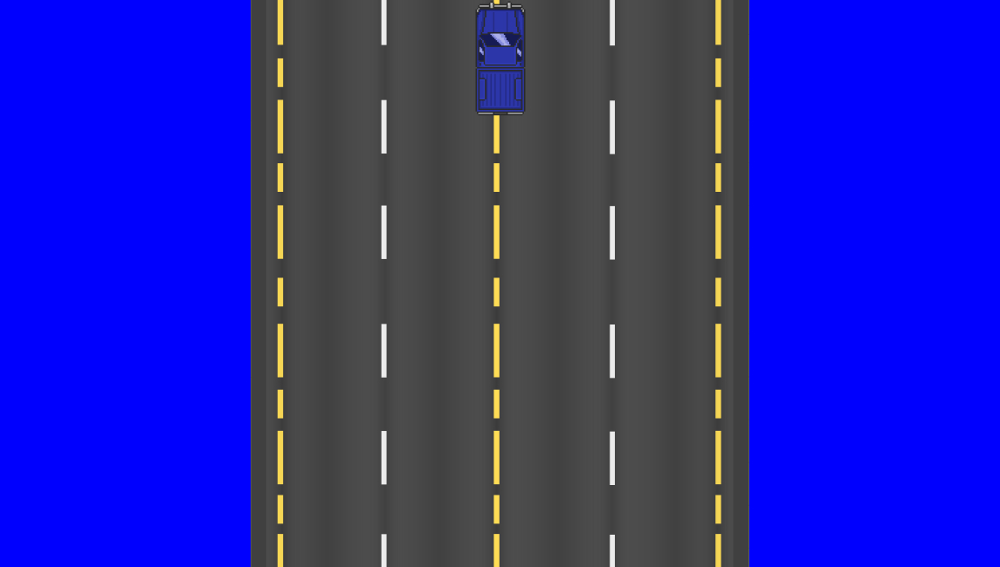
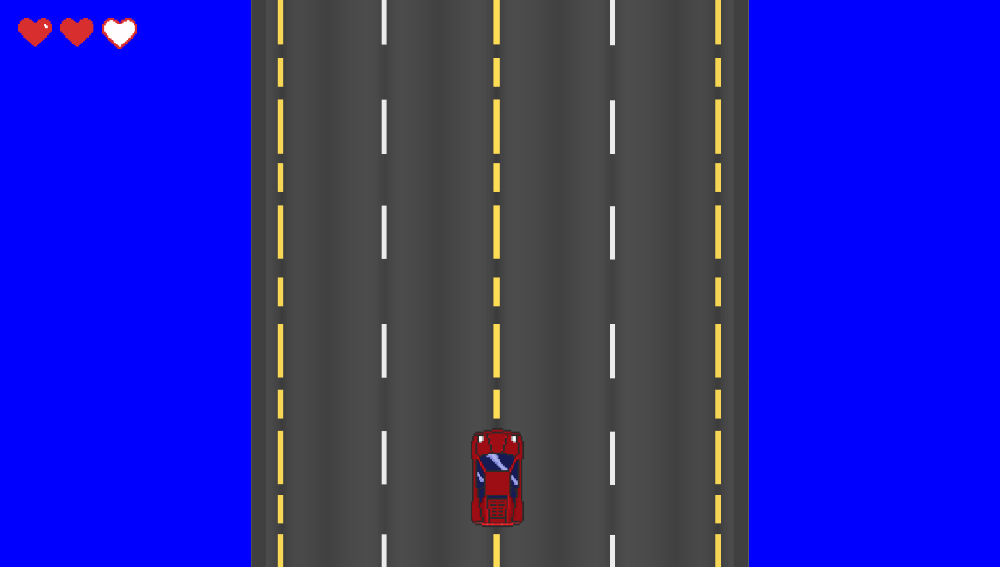

# ironhack-project-1-arcade-game
Primer proyecto de OOP - Videojuego

## ROAD FURY

### Objectivos Primarios (MVP)

- **Juego de coches de scroll vertical**.
- **Player**: Coche que tendrá que esquivar los diferentes obstáculos (**ENEMIES**) que aparezcan programáticamente en su camino.
  - La velocidad del Player se mantendrá constante si no se pulsa ningún botón de dirección. 
  - El Player podrá moverse en las 4 direcciones (`Arriba` - `Abajo` -`Derecha` - `Izquierda`).
  - Si el Player se sale de la carretera, disminuirá su velocidad.
  - El Player tendrá un total de **3 vidas** ❤️❤️❤️. Si colisiona con algún obstáculo dentro o fuera de la carretera (**ENEMY**) perderá una vida. Si el Player pierde sus 3 vidas será **GAME OVER**.
- **Carretera**: La Carretera será el camino principal donde circulará el **Player**. Constará de 4 carriles y el **Player** podrá moverse con libertad dentro de ella.
- **Bordes de la Carretera**: a ambos lados de la Carretera existirá una zona de campo donde aparecerán de manera _programada_ obstáculos (**ENEMIES**) que podrá colisionar con el Player si éste se sale de la carretera y circula por el campo. 
- **Enemies**:  Existirán 2 tipos de obstáculos: _Móviles_ y _Estáticos_.
  - **Móviles**: Coches que aparecerán desde el borde superior de la pantalla y que se irán desplazando hacia la parte inferior de la pantalla a una velocidad ligeramente inferior a la del **Player** 
  - **Estáticos**: Obstáculos que aparecerán de manera programada en los bordes de la carretera. Estos obstáculos tendrá una velocidad constante.

### DEFINICIÓN DE OBJETIVOS

- Game (game.js): Motor del juego. Archivo que servirá para manejar los eventos programados del juego, así como la creación de la **Carretera**, **Player** , **Enemies** y **Vidas**. También controlará la _monitorización de Eventos_ que controlarán el movimiento del **Player** y la gestion de colisiones con los opbstáculos.
- Player (player.js): ???
- Enemies (enemy-car.js, obstacle.js): ???
- Carretera (road.js): Constará de una fila central comopuesta de 4 carriles.
- Bordes (side-road.js.): Unica clase que se usará para crear los bordes de la carretera: **Uno a la izquierda** y **otro a la derecha. 
- Vidas (lives.js): Clases para crear un objeto con una propiedad `lives` con valor 3. 
- ⚡⚡⚡**Colisión de objetos**: Cuando el Payer colisiona con un Enemy el Player se vuelve _invulnerable_ durante 2 segundos en los que parpadeará. 
### TAREAS ALEX

#### 1. Carretera
Terminar el desplazamiento infinito (en el eje vertical) de la carretera para que parezca que se está moviendo.

- [x] Desplazamiento vertical desde el `top` hasta el `bottom` (`height` de `#game-screen`) de los dos background de manera simultánea.
- [x] Detectar cuando el `background1` ha salido de pantalla (el `position.top` es igual al `gameDimensions.height`).
- [x] Cuando hemos detectado que el `background1` ha salido de pantalla vamos a **reiniciar** la posición de ambos background para repetir de nuevo todo el desplazamiento de manera infinita. 

#### 2. Crear un Enemigo móvil (camioneta)
Hay que crear una nueva clase para generar enemigos. Por ahora, sólo necesitamos definir la `Clase` y crear un único `objeto` (**enemigo**).
La clase `Enemy` debe de tener las mismas propiedades que la clase `Player`, aunque se diferenciarán en ciertos valores.

- [x] **Tamaño** (tomar de referencia el tamaño de la imagen `enemy.png`)
- [x] **URL** de la imagen (atributo **src**)
- [x] Para ver que se crea correctamente creamos un nuevo `Enemy()` desde `game.js`. La posición dentro `#game-screen` será en el borde superior vertical centrado horizontalmente:

- [x] Añadir movimiento continuo de `5px` al `Enemy()`desde el borde superior al borde inferior
- [x] Detectar cuando sale de la pantalla por el borde inferior y detener el movimiento justo cuando ha desaparecido.
- [x] Añadir 3 `Enemy()` en total dentro de del ciclo de frames establecido (de `0` a `5000` frames). Establecer cuando van a aparecer en función de los frames que se lleven acumulados.
- [ ] Debemos guardar de alguna manera cada nuevo `Enemy()` para poder gestionar más adelante su borrado tanto dentro de `Game` como en el DOM.
- [x] La posición inicial de cada `Enemy()` debe de estar comprendida **entre el border izquierdo y el borde derecho de la carretera**. Aparecerá, como se ha realizado en el punto anterior, desde fuera del borde superior del `#game-screen` y se desplazará verticalmente de manera continua hasta desaparecer por el borde inferior (igual que en los puntos anteriores).
- [ ] Cuando el `Enemy()` salga por el border inferior y se haya detenido su movimiento debemmos eliminarlo del DOM
- [ ] Cuando el `Enemy()` salga por el border inferior y se haya detenido su movimiento debemmos eliminar su instancia dentro del script de `Game` para economizar memoria

### TAREAS SERGIO

#### 1. Movimiento de Player
- [x] Hacer que el movimiento del `Player` sea más suave
- [x] Crear efecto de empuje hacia abajo cuando se suelte la tecla `ArrowUp` hasta que llege a la `position.base`

#### 2. Crear la Clase Lives
- [x] Crear un nueva base que generará las vidas de las que disponemos
- [x] Cada corazón deberá tener 2 estados: lleno y vacío
- [x] Crear un nuevo objeto desde `game.js` con la nueva clase que muestre 3 corazones en la parte superior izquierda de la pantalla.

- [ ] Comprobar que se cambian las URLs de los corazones de `full` a `empty` cuando se modifica la propiedad `this.lives.current`

#### 3. Crear la funcionalizad de detección de Colision 
- [ ] Detectar la colisión entre el `Player()`y el `Enemy()`
- [ ] Cuando se detecta, debemos restar una vida y se deberá de actualizar la imagen del corazón correspondiente
- [ ] Cuando se hayan perdido 3 vidas se invocará el método `Game.gameOver()`, parando todo el movimiento y cereación de enemigos y mostrando un `alert()`
- [ ] Mejoramos el estado del `gameOver()` quitando el `alert()` y mostarndo un mensaje en el DOM dentro de un modal

## MEJORAS TRAS LOGRAR EL MVP

WIP